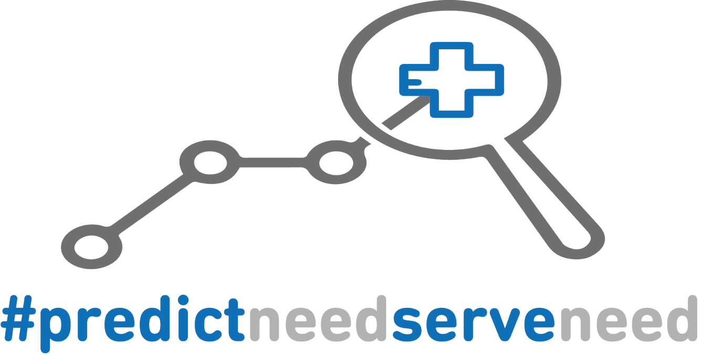
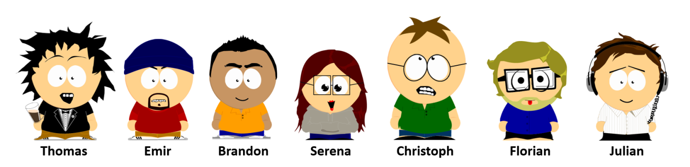
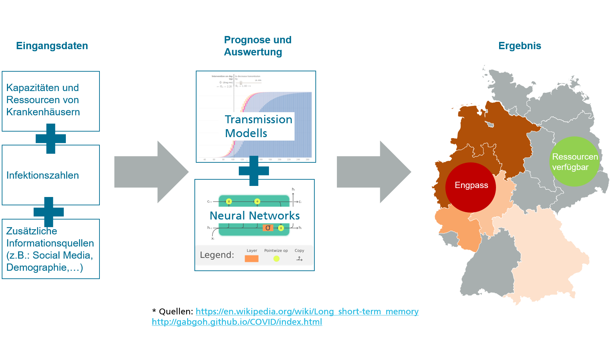
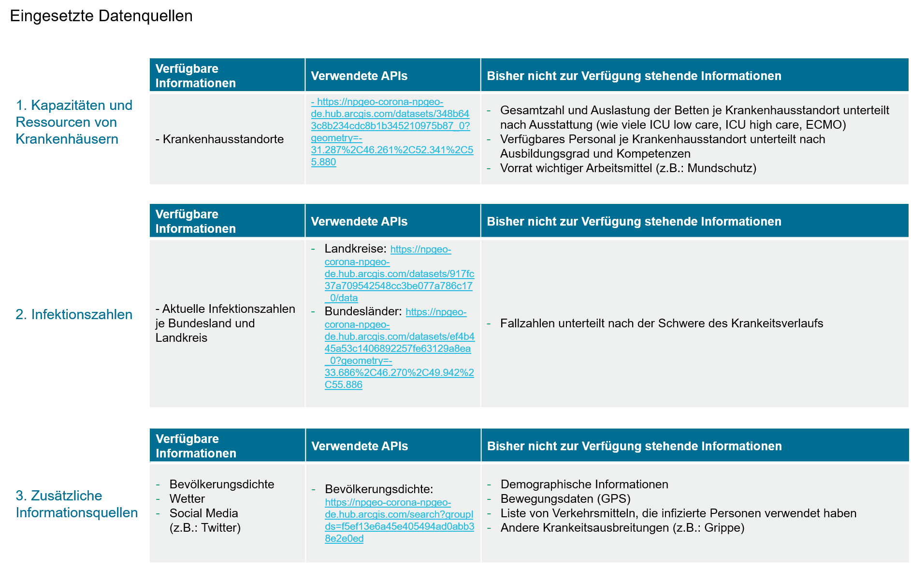

# MAXCAP - WirvsVirus

Welcome to our contribution to #WirvsVirus!

## Overview of concepts

## Overview Data Sources

## Technical concept

Die Applikation verbindet sich zu den verschiedensten APIs und stellt alle relevanten Informationen in einer Datenbank zur Verfügung. Die Datensätze werden aktuelle alle 24 Stunden automatisiert aktualisiert und sind somit immer aktuell. Die Synchronisation erfolgt dann über die Datenbank, damit hat man den Vorteil, dass andere Teams sprachunabhängig sind. Die verarbeiteten Daten sollten  in einer weiteren Collection gespeichert werden. So ist es möglich das sich das System über Nacht wieder selbst heilt.
Aktueller Technologie-Stack: Spring Boot mit Java 13, MongoDB Atlas, Python
